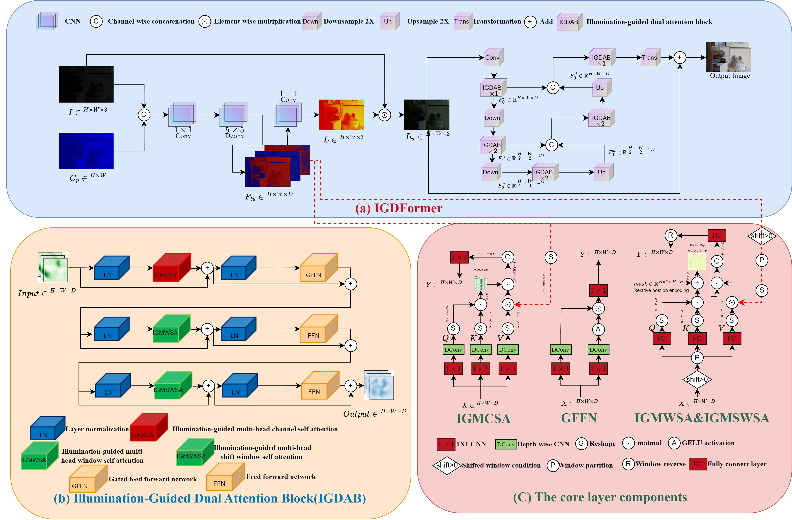

# IGDFormer-light-up-dark
Pytorch implemention
<h2>  
Dual attention Transformer based on illumination-guided for low-light image enhancement

</h2>

Central south university

[](https://drive.google.com/drive/folders/1ykdAAcm26T_wsI8sT32imPMToIhL7GwD?usp=drive_link)
</div>

## Overall Architecture



## Getting Started
### Environment

1. Clone this repo:

```
git clone https://github.com/YanJieWen/IGDFormer-light-up-dark.git
cd IGDFormer-light-up-dark-master/
```

### Data Preparation
1. Download the dataset: [[Retinexformer](https://github.com/caiyuanhao1998/Retinexformer.git)]
2. Create the new root and put datasets into `parired_datasets`.

 ### Training
1. For single GPU train: Run the [[train](train_engine.py)] and you can change the params follow your device.
2. For multi GPU and single PC: Run `accelerate launch --multi_gpu train_engine.py`
3. For more details, please check [[HUGGING FACE](https://huggingface.co/datasets/HuggingFace-CN-community/translation/blob/main/eat_accelerate_in_30_minites.md)]

### Evaluation and demo
Make sure you have down load pretrained weights from [Google](https://drive.google.com/drive/folders/1ykdAAcm26T_wsI8sT32imPMToIhL7GwD?usp=drive_link),
and put them into the `save_weights` root. Run [[validation](validation.py)] or [[demo](demo.py)]
## Acknowledgement
Thank you for the surprise works that we follow：
1. [BasicSR](https://github.com/XPixelGroup/BasicSR.git)
2. [Retinexformer](https://github.com/caiyuanhao1998/Retinexformer)
3. [Restormer](https://github.com/swz30/Restormer.git)
4. [Huggingface](https://github.com/huggingface/huggingface_hub)

 
